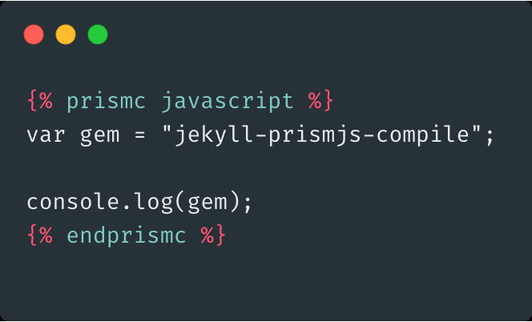

# Jekyll::PrismCompileBlock



Liquid tag for pre-processing [Prism.js](https://prismjs.com/) highlights

```

var gem = "jekyll-prismjs-compile";

console.log(gem);

```

For more information please check [this blog post](https://mhasbini.com/blog/jekyll-prism-compile-plugin.html)

## Installation

Add this line to your application's Gemfile:

```
 group :jekyll_plugins do
   gem "jekyll-prismjs-compile"
 end
```

And then execute:

    $ bundle

Or install it yourself as:

    $ gem install jekyll-prismjs-compile

Then add the following to your site's `_config.yml`:

```
plugins:
  - jekyll-prismjs-compile
```

Please check [documentation](https://jekyllrb.com/docs/plugins/installation/) for more information on installation.

## Usage

Use the tag as follows in your Jekyll pages, posts and collections:

```liquid

var gem = "jekyll-prismjs-compile";

console.log("gem");

```

Make sure that you have the prism css included:
```html
<link href="prism.css" rel="stylesheet" type="text/css">
```

💡 You don't have to include `prism.js`
